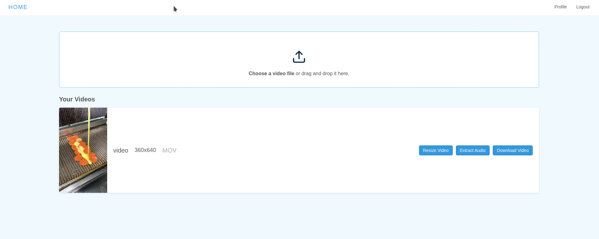

# 🎬 Video Editor

A modern web application for resizing and extracting audios

## 🚀 Features

- **Browser-based editing** - No installations required
- **Authentication & session** - Saves sessions to continue later
- **Resize & extrat audio**

## 🛠️ Tech Stack

### Frontend
- **React.js**

### Backend
- **Node.js**
- **Express.js** 
- **File-based storage** (JSON database)

### Tools
- **Git** (Version control)

## 📦 Installation

### Prerequisites
- Node.js 
- FFmpeg (for full functionality)
  
  ```
  sudo apt-get install ffmpeg
  ```

- To start project, run:

  ```
  git clone git@github.com:jamil-babayev/Video-Editor.git
  cd Video-Editor
  npm install
  node src/index.js
  ```
### Snapshots


  
